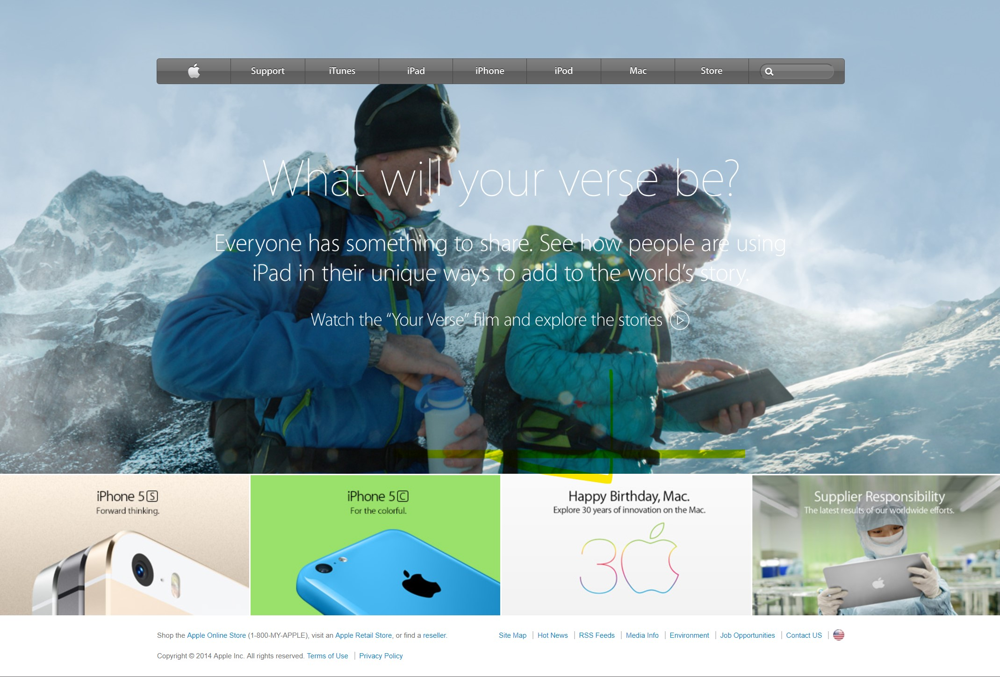

# Building with Backgrounds and Gradients

This is the fourth project of the Main HTML/CSS curriculum at Microverse - @microverseinc.

- The goal was to create a clone of [this](https://web.archive.org/web/20140301004610/http://www.apple.com/) page.
- The project was completed using simple html and css.

Assignment link: https://www.theodinproject.com/courses/html5-and-css3/lessons/building-with-backgrounds-and-gradients

Author: [@archemiro](https://github.com/archemiro)
